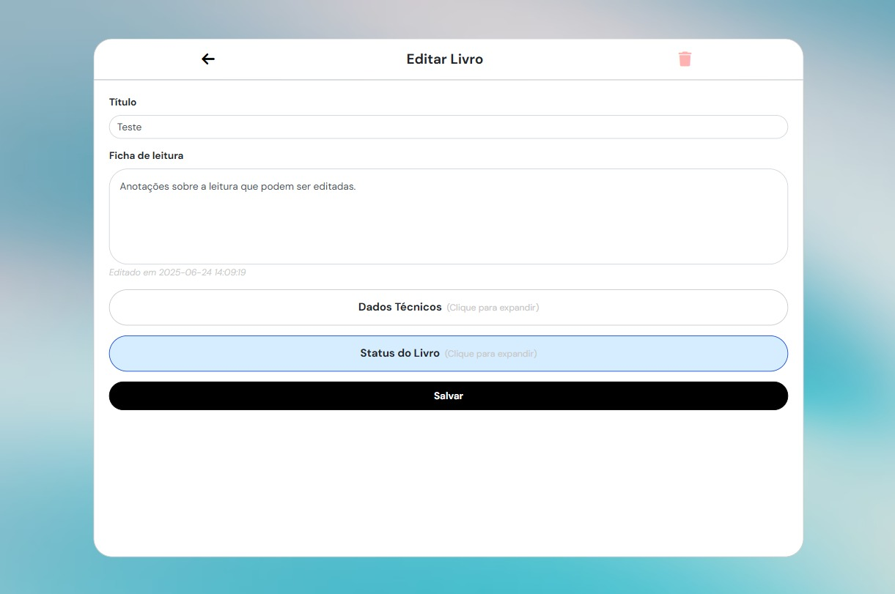
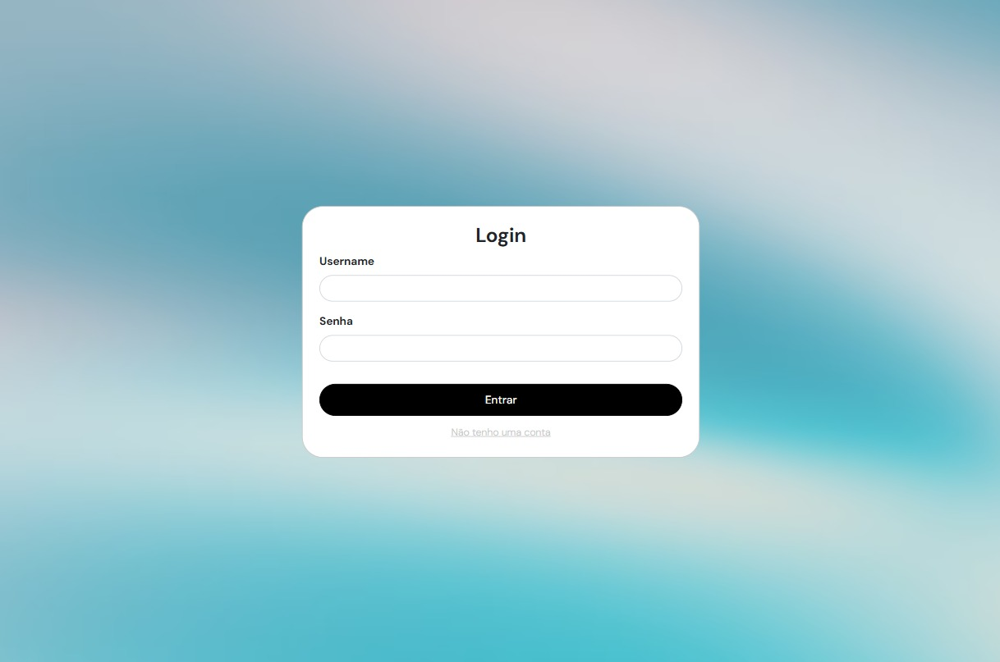

# Gerenciador de Biblioteca Pessoal

  

## Objetivo
Sistema web onde usuários autenticados possam catalogar seus livros, atribuindo status, anotações e categorizando-os.

## Aprendizados
- Implementar arquitetura MVC que eu consegui entender o conceito nas aulas mas tive dificuldade para abstrair e escrever o código.
- Fazer um diagrama de classes usando o Astah (curso modelagem de dados).
- Aprendi de fato como transformar dados do PHP em JSON e enviar para o Javascript com o json_encode.
- Melhorei as minhas queries SQL (COUNT/SUM + CASE WHEN THEN ELSE).
- Colocar backdrop-filter: blur() para aplicar desfoque no plano de fundo.
  
## Tecnologias
- PHP, Composer, MYSQL, HTML, CSS, Bootstrap (Layout Responsivo), Javascript, Charts.js, Ícones Fontawesome
- Arquitetura MVC (primeira vez que implemento).
- Foi utilizado strict_types no PHP.
- Hashing de senha no banco de dados.
- PDO para queries trazendo mais segurança tanto para o site quanto para o banco de dados.
- JSON para transferir dados do PHP (banco de dados) para o JS (gráficos com charts.js).
- Astah UML para criar o diagrama de classes.

## Observações / Melhorias
- O código foi todo documentado, no PHP usei a extensão do VSCode chamada DocBlocker e nas demais linguagens documentei por meio de comentários.
- Tudo o que foi implementado no projeto foi de forma consciente pois não peguei nenhum código no cntrl c cntrl v, mas acredito que quando eu iniciar o meu próximo projeto eu venha a ter dificuldade para organizar as classes do MVC. Porém com a prática vai se tornar algo automático.
- Preciso melhorar o tratamento de erros, atualmente lanço exceptions e dou echo nas views.

### Diagrama de Classes

  

## User Interface (views)
### Novo Livro
- Usuário adiciona um novo livro a sua biblioteca.
- Inputs opcionais de ano de publicação e páginas.

  

### Biblioteca
- Exibe todos os livros da biblioteca do usuário.
- Livros são organizados na ordem de status (em leitura, lidos e por ler).

  

### Pesquisa
- Usuário pode pesquisar por livros.
- Pode-se pesquisar por texto ou nos atalhos rápidos de filtrar livros por status.

  

### Gerenciar Livro
- Usuário pode editar os dados do livro ou excuí-lo.
- Para não diminuir a carga cognitiva apenas as partes que são editadas com mais frequência ficam aparentes, para editar dados técnicos ou o status do livro precisa clicar na caixa que expande e exibe os campos de edição dos dados.

  

### Gráficos
- Usuário pode ver dados sobre os livros na biblioteca.
- Relações entre páginas, categorias e status de livros.

  

### Editar Conta
- Usuário pode editar seu username e email.

  

### Login
- Formulário de login.

  

### Registro
- Formulário de registro.

  

